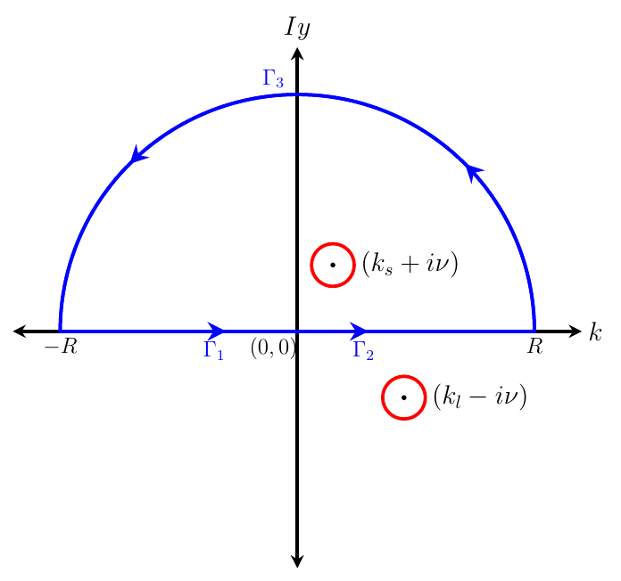
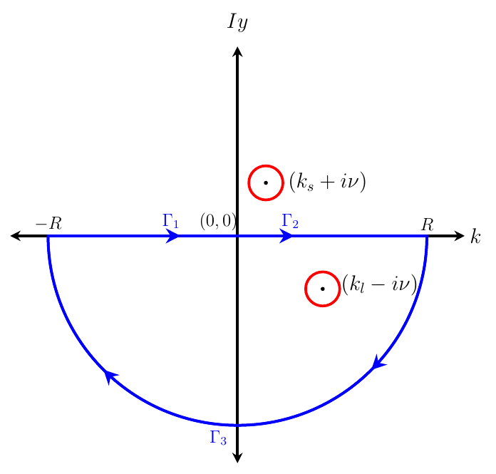

# Derivation of the steady interfacial displacement for capillary-gravity waves: $\alpha \geq 0$

We investigate the steady response (i.e. all the time derivative terms are neglected) of the present problem using the method of Rayleigh (1883) & Lamb (1932). Then the dimensional, linearised equations of motion are:

```math
\tilde{\nabla}^2\tilde{\vp}_u=0,\quad  -\infty < \tilde{x} < \infty,\quad \tilde{\eta}(\tilde{x}) \leq \tilde{z} < \infty \tag{2.1a}
```

```math
\tilde{\nabla}^2\tilde{\vp}_l=0,\quad  -\infty < \tilde{x} < \infty,\quad -\infty < \tilde{z} \leq \tilde{\eta}(\tilde{x}) \tag{2.1b}
```

with boundary conditions (kinematic and dynamic):

```math
U\left(\dfrac{\partial\tilde{\eta}}{\partial \tilde{x}}\right) - \left(\dfrac{\partial\tilde{\vp}_u}{\partial \tilde{z}}\right)_{\tilde{z}=0} =  U\left(\dfrac{\partial\tilde{\eta}}{\partial \tilde{x}}\right) - \left(\dfrac{\partial\tilde{\vp}_l}{\partial \tilde{z}}\right)_{\tilde{z}=0} =  0 \tag{2.1c}
```

```math
- T\dfrac{\partial^2\tilde{\eta}}{\partial\tilde{x}^2} +  U\rho_l\left(\dfrac{\partial\tilde{\vp}_l}{\partial \tilde{x}}\right)_{z=0} - U\rho_u\left(\dfrac{\partial\tilde{\vp}_u}{\partial \tilde{x}}\right)_{z=0} \\
+ \left(\rho_l - \rho_u\right)g\tilde{\eta} +\rho_l\tilde{\mu'}\left(\tilde{\vp_l}\right)_{z=0}-\rho_u\tilde{\mu'}\left(\tilde{\vp_u}\right)_{z=0} = -\tilde{p}_e(\tilde{x},\tilde{z}=0^{+}) \tag{2.1d}
```

```math
\frac{\partial \tilde{\vp}_u}{\partial \tilde{z}} \to \text{finite} \quad \text{as } \; \tilde{z}\to\infty \tag{2.1e}
```

```math
\frac{\partial \tilde{\vp}_l}{\partial \tilde{z}} \to \text{finite} \quad \text{as } \; \tilde{z}\to-\infty \tag{2.1f}
```

Here $\tilde{\nabla}^2 \equiv \dfrac{\partial^2}{\partial \tilde{x}^2} + \dfrac{\partial^2}{\partial \tilde{z}^2}$.

We non-dimensionalise these equations using the length-scale $l_c = U^2/g$, velocity potential scale $\vp_c = U^3/g$ and the pressure scale $p_c=\rho_lU^2$.

These lead to non-dimensional variables which are:

```math
\left(x,z,\eta\right) \equiv \dfrac{1}{l_c}\left(\tilde{x},\tilde{z},\tilde{\eta}\right),\;\; \;\;p \equiv  \dfrac{\tilde{p}}{\rho_lU^2},\;\; \vp \equiv \dfrac{\tilde{\vp}}{\vp_c},\;\; \nabla \equiv l_c \tilde{\nabla} \tag{2.2}
```

In terms of these non-dimensional variables, the equations above become:

```math
\nabla^2\vp_u=0,\quad\quad -\infty < x < \infty,\quad \eta(x) \leq z < \infty \tag{2.3a}
```

```math
\nabla^2\vp_l=0,\quad\quad -\infty < x < \infty,\quad -\infty < z \leq \eta(x) \tag{2.3b}
```

```math
\dfrac{\partial\eta}{\partial x} - \left(\dfrac{\partial\vp_u}{\partial z}\right)_{z=0} =  \dfrac{\partial\eta}{\partial x} - \left(\dfrac{\partial\vp_l}{\partial z}\right)_{z=0} =  0 \tag{2.3c}
```

```math
-\alpha \left(\dfrac{\partial^2\eta}{\partial x^2}\right) +  \left(\dfrac{\partial\vp_l}{\partial x}\right)_{z=0} - \rho_r\left(\dfrac{\partial\vp_u}{\partial x}\right)_{z=0}
+ \left(1 - \rho_r\right)\eta+\mu'\left(\vp_l\right)_{z=0}-\rho_r\mu'\left(\vp_u\right)_{z=0}  = -p_e(x,z=0^{+}) \tag{2.3d}
```

```math
\frac{\partial \vp_u}{\partial z} \to \text{finite} \quad \text{as } \; z\to\infty \tag{2.3e}
```

```math
\frac{\partial \vp_l}{\partial z} \to \text{finite} \quad \text{as } \; z\to-\infty \tag{2.3f}
```

where $\alpha \equiv \dfrac{gT}{\rho_lU^4}$ and the density ratio $\rho_r \equiv \dfrac{\rho_u}{\rho_l}$. With $p_e(x,0^{+}) = F_0\delta(x)$, the theory is characterised by three non-dimensional numbers viz. the $\alpha$, density ratio $\rho_r$ and the strength of the point force $F_0$.

As pressure $p_{e}$ in equation (2.3d) is only at $\tilde{z}=0$, we have suppressed the $z$ dependence of pressure in equation (2.3d).

Then the Fourier transform of equations above lead to the following equations,

```math
\frac{\partial^2 \bar{\vp}_u}{\partial z^2} - k^2\bar{\vp}_u = 0 \tag{2.4a}
```

```math
\frac{\partial^2 \bar{\vp}_l}{\partial z^2} - k^2\bar{\vp}_l = 0 \tag{2.4b}
```

```math
ik\bar{\eta}-\left(\frac{\partial \bar{\vp}_u}{\partial z}\right)_{z=0}=0 \tag{2.4c}
```

```math
ik\bar{\eta}-\left(\frac{\partial \bar{\vp}_l}{\partial z}\right)_{z=0}=0 \tag{2.4d}
```

```math
\alpha k^2 \bar{\eta}+ik\left(\bar{\vp}_l\right)_{z=0}-\rho_r ik\left(\bar{\vp}_u\right)_{z=0} +(1-\rho_r)\bar{\eta}+\mu'\left(\bar{\vp_l}\right)_{z=0}-\rho_r\mu'\left(\bar{\vp}_u\right)_{z=0} = -\bar{p}_e(k) \tag{2.4e}
```

```math
\frac{\partial \bar{\vp}_u}{\partial z} \to \text{finite} \quad \text{as } \; z\to\infty \tag{2.4f}
```

```math
\frac{\partial \bar{\vp}_l}{\partial z} \to \text{finite} \quad \text{as } \; z\to-\infty \tag{2.4g}
```

The Laplace equations (2.4a) and (2.4b) are easily solved subject to boundedness condition (2.4f) and (2.4g) respectively to obtain

```math
\bar{\vp}_u(k;z)=D(|k|)\exp (-|k|z),\quad \bar{\eta}(k) \leq z < \infty \tag{2.5a}
```

```math
\bar{\vp}_l(k;z)=A(|k|)\exp (|k|z),\quad -\infty< z \leq \bar{\eta}(k) \tag{2.5b}
```

Substituting (2.5a) in (2.4c) gives $\left(\bar{\vp}_u\right)_{z=0}=-i\bar{\eta}\frac{k}{|k|}$ and substituting (2.5b) in (2.4d) gives $\left(\bar{\vp}_l\right)_{z=0}=i\bar{\eta}\frac{k}{|k|}$. Substituting $\left(\bar{\vp}_u\right)_{z=0}$ and $\left(\bar{\vp}_l\right)_{z=0}$ in (2.4e) gives

```math
\bar{\eta}(k)=\frac{-\bar{p}_e(k)}{\alpha k^2 - |k|(1+\rho_r)+(1-\rho_r)+i\mu' \frac{k}{|k|} \left(1+\rho_r\right)} \tag{2.6}
```

The Fourier inversion of (2.6) gives

```math
\eta (x)=\frac{1}{\sqrt{2\pi}}\int_{-\infty}^{\infty}dk\;e^{ikx}\frac{-\bar{p}_e(k)}{\alpha k^2 - |k|(1+\rho_r)+(1-\rho_r)+i\mu' \frac{k}{|k|} \left(1+\rho_r\right)} \tag{2.7}
```

For $p_e(x,z=0)=F_0\;\delta(x)$, recall that $\bar{p}_e=F_0/ \sqrt{2\pi}$. We may write (2.7) as

```math
\eta (x)=\frac{-F_0}{2\pi}\Biggl\{\int_{0}^{\infty}dk\;\frac{\exp (ikx)}{\alpha k^2 - k(1+\rho_r)+(1-\rho_r)+i\mu' \left(1+\rho_r\right)}
+ \int_{0}^{\infty}dk\;\frac{\exp (-ikx)}{\alpha k^2 - k(1+\rho_r)+(1-\rho_r)-i\mu' \left(1+\rho_r\right)}\Biggl\} \tag{2.8}
```

In (2.8) both integrals denominators have same real part (i.e. ${\alpha k^2 - k(1+\rho_r)+(1-\rho_r)}$). Roots of this quadratic equation gives

```math
k_l=(1+\rho_r)\left[\frac{1+\sqrt{1-4\alpha\frac{1-\rho_r}{(1+\rho_r)^2}}}{2\alpha}\right] \tag{2.9a}
```

```math
k_s=(1+\rho_r)\left[\frac{1-\sqrt{1-4\alpha\frac{1-\rho_r}{(1+\rho_r)^2}}}{2\alpha}\right] \tag{2.9b}
```

Using above $k_l$ and $k_s$ definitions, one can write $\alpha k^2 - k(1+\rho_r)+(1-\rho_r)=\alpha(k-k_s)(k-k_l)$. Using this relation we can rewrite (2.8) as

```math
\frac{\eta(x)}{F_0}=\frac{-1}{2\pi}\Biggl\{\int_{0}^{\infty}dk\;\frac{\exp (ikx)}{\alpha(k-k_s)(k-k_l)+i\mu' \left(1+\rho_r\right)}+\int_{0}^{\infty}dk\;\frac{\exp (-ikx)}{\alpha(k-k_s)(k-k_l)-i\mu' \left(1+\rho_r\right)}\Biggl\} \tag{2.10}
```

By combining the two integrals in the above equation (imaginary parts vanishes), one obtains

```math
\frac{\eta(x)}{F_0}=\frac{1}{\pi}\int_{0}^{\infty}dk\;\frac{\alpha(k-k_s)(k_l-k)\cos\left(kx\right)-\mu' \left(1+\rho_r\right)\sin\left(kx\right)}{\alpha^2(k-k_s)^2(k_l-k)^2+\left(\mu'\right)^2 \left(1+\rho_r\right)^2} \tag{2.11}
```

Equation (2.11) is the real part of the below integral

```math
\frac{\eta(x)}{F_0}=\frac{1}{\pi \alpha}\int_{0}^{\infty}dk\;\frac{ \exp (ikx)}{(k-k_s)(k_l-k)-i\mu''} \tag{2.12}
```

where $\mu''=\frac{\mu' \left(1+\rho_r\right)}{\alpha}$, (since $\mu'$ is taken as infinitesimal, here $\mu''$ also becomes infinitesimal). So solving the above equation (2.12) and discarding imaginary part of the solution is same as solving (2.11). Equation (2.12) has two singular poles, these poles can be obtained by finding the roots of the denominator, they are

```math
k=k_{s}+i\nu \tag{2.13}
```

```math
k=k_{l}-i\nu \tag{2.14}
```

where,

```math
\nu=\frac{\mu^{''}}{k_{l}-k_{s}} \tag{2.15}
```

Using (2.13), (2.14), (2.15), we can write

```math
(k-k_s)(k_l-k)-i\mu''=-\left[\left\{k-(k_{s}+i\nu)\right\}\left\{k-(k_{l}-i\nu)\right\}\right] \tag{2.16}
```

Substituting (2.16) into (2.12) and performing a partial-fraction decomposition of the integrand yield

```math
\frac{\eta(x)}{F_0}	=\frac{1}{\pi \alpha}\frac{1}{(k_{l}-k_{s}-2i\nu)}\left[\mathbb{I}_{9}(x)-\mathbb{I}_{10}(x)\right] \tag{2.17}
```

where, we define

```math
\mathbb{I}_{9}(x)=\int_{0}^{\infty} dk\;\frac{\exp (ikx)}{k-(k_{s}+i\nu)} \tag{2.18a}
```

```math
\mathbb{I}_{10}(x)=\int_{0}^{\infty} dk\;\frac{\exp (ikx)}{k-(k_{l}-i\nu)} \tag{2.18b}
```

The integrals $\mathbb{I}_9(x)$ and $\mathbb{I}_{10}(x)$ are singular at $k=k_{s}+i\nu$ and $k=k_{l}-i\nu$. Hence they may be solved by Cauchy residue theorem. Cauchy residue theorem is defined as the integral over the closed contour is equal to $2 \pi i$ times sum of residues of the poles which are enclosed in that closed contour. The residue of a function $f(z)$ at a simple pole $z_0$ is defined as $\operatorname{Res}\left[f(z), z_0\right]=\displaystyle \lim_{z \to z_0}(z-z_0)f(z)$. The corresponding contours are shown in Figure 1(a) and (b). Consider the integral $\mathbb{I}_9^c(x)$ along the closed contour shown in Figure 1(a) for $x>0$:

```math
\mathbb{I}_9^c(x) = \oint dz \,  \frac{\exp\left(izx\right)}{(z - (k_s + i\nu))}, \qquad x>0 \tag{2.19}
```

$\mathbb{I}_9^c(x)$ will be sum of residues of poles which are enclosed in the closed contour. Further, upon breaking this integral along the individual segments of the contour, one may write as

```math
\mathbb{I}_9^c(x) = 2 \pi i \exp \left(ik_s x\right) =	\int_{\Gamma_1} dz \,  \frac{\exp\left(izx\right)}{(z - (k_s + i\nu))} + \int_{\Gamma_2} dz \,  \frac{\exp\left(izx\right)}{(z - (k_s + i\nu))} + \int_{\Gamma_3} dz \,  \frac{\exp\left(izx\right)}{(z - (k_s + i\nu))} \tag{2.20}
```

The integral on the semi circle $\Gamma_3$ tends to zero as $R \to \infty$ for $x>0$, as argued below,

```math
\lim_{R \rightarrow \infty}\left[\int_{\Gamma_3} dz \,  \frac{\exp\left(izx\right)}{(z - (k_s + i\nu))}\right]=\lim_{R \rightarrow \infty} \left[\int_{0}^{\pi} d\theta \, iR \exp(i \theta) \frac{\exp\left(ixR \cos(\theta)\right)\exp\left(-xR \sin(\theta)\right)}{(R \exp(i \theta) - (k_s + i \nu))} \right] \tag{2.21}
```

The value of the integrand above is governed by the factor $\exp(-xR\sin\theta)$ which tends to zero as $R \to \infty$ for $x>0$ by Jordan's lemma, since $\sin(\theta)$ is always positive in the first and second quadrants. In view of this (2.20) reduces to,

```math
\lim_{R \to \infty}\left[\int_{-R}^{0} dk\;\frac{ \exp(ikx)}{k-(k_{s}+i\nu)}+\int_{0}^{R} dk\;\frac{\exp(ikx)}{k-(k_{s}+i\nu)}\right] =2\pi i\exp(ik_s x) \, , \qquad x>0 \tag{2.22}
```

Upon completing the limiting process and evaluating the terms, one obtains,

```math
\mathbb{I}_9(x) =	\int_{0}^{\infty} dk\;\frac{\exp(ikx)}{k-(k_{s}+i\nu)}=2\pi i\exp(ik_s x)+\int_{0}^{\infty} dk\;\frac{\exp(-ikx)}{k+(k_{s}+i\nu)} \, , \qquad x>0 \tag{2.23}
```

Since $\nu$ is assumed to be infinitesimally small, we may write the above (2.23) as

```math
\int_{0}^{\infty} dk\;\frac{\exp(ikx)}{k-k_{s}}=2\pi i\exp(ik_s x)+\int_{0}^{\infty} dk\;\frac{\exp(-ikx)}{k+k_{s}} \, , \qquad x>0 \tag{2.24}
```

Similarly for $x<0$ one performs similar steps of contour integration using Figure 1(b) (note that here $(k_s+i \nu)$ pole is lying outside of the closed contour and residue of $(k_l-i \nu)$ pole becomes zero) and one obtains,

```math
\int_{0}^{\infty} dk\;\frac{\exp(ikx)}{k-k_{s}}=\int_{0}^{\infty} dk\;\frac{\exp(-ikx)}{k+k_{s}}\, , \qquad x<0 \tag{2.25}
```

The integral $\mathbb{I}_{10}(x)$ in (2.18b) has identical mathematical structure as $\mathbb{I}_9(x)$ with $(k_s + i \nu)$ pole is replaced with $(k_l - i \nu)$ pole, accordingly one may write

```math
\int_{0}^{\infty} dk\;\frac{\exp(ikx)}{k-k_{l}}=\int_{0}^{\infty} dk\;\frac{\exp(-ikx)}{k+k_{l}}\, , \qquad x>0 \tag{2.26}
```

and

```math
\int_{0}^{\infty} dk\;\frac{\exp(ikx)}{k-k_{l}}=-2\pi i\exp(ik_l x)+\int_{0}^{\infty} dk\;\frac{\exp(-ikx)}{k+k_{l}}\, , \qquad x<0 \tag{2.27}
```

Upon plugging (2.24), (2.25), (2.26), (2.27) in (2.17) and keeping $\nu = 0$ in (2.17) then discarding its imaginary terms, yield

```math
\frac{\eta(x)}{F_0}	=-\frac{2}{\alpha({k_{l}-k_{s}})}\sin{(k_{s}x)}+\frac{G(x)}{\pi \alpha}\, , \qquad x>0 \tag{2.28}
```

and

```math
\frac{\eta(x)}{F_0}=-\frac{2}{\alpha({k_{l}-k_{s}})}\sin{(k_{l}x)}+\frac{G(x)}{\pi \alpha}\, , \qquad x<0 \tag{2.29}
```

where,

```math
G(x)=\frac{1}{k_{l}-k_{s}}\left[\int_{0}^{\infty} \frac{\cos (kx)}{k+k_{s}}dk-\int_{0}^{\infty} \frac{\cos (kx)}{k+k_{l}}dk\right] \tag{2.30}
```

**Figure 1:** Contours for evaluating $\mathbb{I}_9(x)$ in equation (2.18a) (left, $x>0$) and $\mathbb{I}_{10}(x)$ in equation (2.18b) (right, $x<0$). The quadrants for semi circles ($\Gamma_3$) are so chosen that the value of the integral vanishes as $R\rightarrow\infty$.




