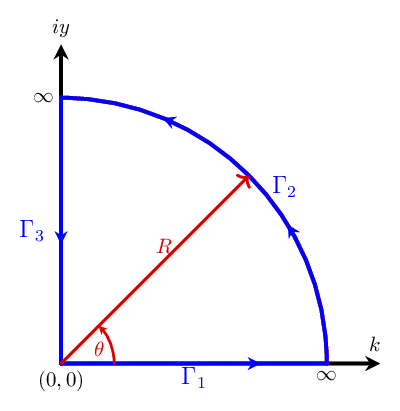
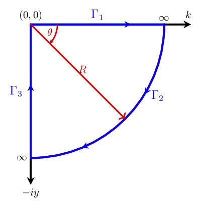

# Equivalence of $\eta^{\text{local}}_{s}(x)$ in the IVP formulation and $G(x)$ in the Rayleigh dissipation approach

The $G(x)$ obtained from Rayleigh dissipation approach is given in equation (2.12) of the manuscript. This function may be shown to be exactly the same as the exponential decay term $\eta^{\text{local}}_{s}(x)$ in the time-independent solution of the present Initial Value Problem (IVP) given in our results (see equation (2.11) of the manuscript). This equivalence may be demonstrated by applying the Cauchy residue theorem to $G(x)$. Let us start this procedure by combining the two cosine integrals in $G(x)$ to obtain a single integral:

```math
G(x) = \int_{0}^{\infty} dk\, \frac{\cos(kx)}{(k+k_s)(k+k_l)} \tag{2.32}
```

Writing cosine in exponential form:

```math
G(x) = \frac{1}{2} \left[ \mathbb{I}_{11}(x) + \mathbb{I}_{12}(x) \right] \tag{2.33}
```

where we define:

```math
\mathbb{I}_{11}(x) = \int_{0}^{\infty} dk\, \frac{\exp(ikx)}{(k+k_s)(k+k_l)} \tag{2.34}
```

```math
\mathbb{I}_{12}(x) = \int_{0}^{\infty} dk\, \frac{\exp(-ikx)}{(k+k_s)(k+k_l)} \tag{2.35}
```

The integrals $\mathbb{I}_{11}(x)$ and $\mathbb{I}_{12}(x)$ may be evaluated using contour integration by the Cauchy residue theorem. The corresponding contours are shown in Figure 2. Note that no poles are enclosed within the closed contours.

|  |  |
|:---:|:---:|
| (a) $x>0$ | (b) $x<0$ |

**Figure 2**: Contours for evaluating $\mathbb{I}_{11}(x)$ in equation (2.34). The same contours in the reverse order ($x$ replaced with $-x$) will be valid for $\mathbb{I}_{12}(x)$ as well. The quadrants for quarter circles ($\Gamma_2$) are so chosen that the value of the integral vanishes as $R\rightarrow\infty$. Integral along the paths $\Gamma_3$ coinciding with the imaginary axes are regular and bounded as $R\rightarrow\infty$.

Consider the integral $\mathbb{I}_{11}^c(x)$ along the closed contour shown in Figure 2(a) for $x>0$:

```math
\mathbb{I}_{11}^c(x) = \oint dz\, \frac{\exp(izx)}{(z+k_s)(z+k_l)} \tag{2.36}
```

The above integral $\mathbb{I}_{11}^c(x)$ will be zero since the closed contour does not enclose any poles. Breaking this integral along the individual contour segments:

```math
\mathbb{I}_{11}^c(x) = 0 = \int_{\Gamma_1} dz\, \frac{\exp(izx)}{(z+k_s)(z+k_l)} + \int_{\Gamma_2} dz\, \frac{\exp(izx)}{(z+k_s)(z+k_l)} + \int_{\Gamma_3} dz\, \frac{\exp(izx)}{(z+k_s)(z+k_l)} \tag{2.37}
```

The integral on the large quarter circle $\Gamma_2$ tends to zero as $R \to \infty$ for $x>0$. This is demonstrated as follows:

```math
\lim_{R\rightarrow\infty}\left[\oint d\theta\, iR\exp(i\theta)\, \frac{\exp(ixR\cos\theta)\exp(-xR\sin\theta)}{(R\exp(i\theta)+k_s)(R\exp(i\theta)+k_l)}\right] \tag{2.38}
```

The integrand decays as $\exp(-xR\sin\theta)$, which tends to zero as $R \to \infty$ for $x>0$ by Jordan's lemma, since $\sin(\theta)$ is always positive in the first quadrant. Thus equation (2.36) reduces to:

```math
\lim_{R\rightarrow\infty}\left[\int_{0}^{R} dk\, \frac{\exp(ikx)}{(k+k_s)(k+k_l)} - i\int_{0}^{R} dy\, \frac{\exp(-yx)}{(iy+k_s)(iy+k_l)}\right] = 0 \tag{2.39}
```

Completing the limiting process, we obtain:

```math
\mathbb{I}_{11}(x) = \int_{0}^{\infty} dk\, \frac{\exp(ikx)}{(k+k_s)(k+k_l)} = i\int_{0}^{\infty} dy\, \frac{\exp(-yx)}{(iy+k_s)(iy+k_l)}, \quad x>0 \tag{2.40}
```

Similarly, for $x<0$, performing contour integration using Figure 2(b):

```math
\mathbb{I}_{11}(x) = \int_{0}^{\infty} dk\, \frac{\exp(ikx)}{(k+k_s)(k+k_l)} = -i\int_{0}^{\infty} dy\, \frac{\exp(yx)}{(iy-k_s)(iy-k_l)}, \quad x<0 \tag{2.41}
```

The integral $\mathbb{I}_{12}(x)$ has the same structure as $\mathbb{I}_{11}(x)$ with $x$ replaced by $-x$:

```math
\mathbb{I}_{12}(x) = \int_{0}^{\infty} dk\, \frac{\exp(-ikx)}{(k+k_s)(k+k_l)} = -i\int_{0}^{\infty} dy\, \frac{\exp(-yx)}{(iy-k_s)(iy-k_l)}, \quad x>0 \tag{2.42}
```

```math
\mathbb{I}_{12}(x) = \int_{0}^{\infty} dk\, \frac{\exp(-ikx)}{(k+k_s)(k+k_l)} = i\int_{0}^{\infty} dy\, \frac{\exp(yx)}{(iy+k_s)(iy+k_l)}, \quad x<0 \tag{2.43}
```

Substituting equations (2.40), (2.41), (2.42), and (2.43) into equation (2.33) and separating the real and imaginary parts (which vanish), we obtain:

```math
G(x) = (k_l+k_s)\int_{0}^{\infty} dy\, \frac{y\exp(-y|x|)}{(y^2+k_s^2)(y^2+k_l^2)}, \quad -\infty<x<\infty \tag{2.44}
```

Comparing the above expression for $G(x)$ with the equation (2.11) of the manuscript we can see that $G(x)/ \pi \alpha$ is exactly the same as $\eta^{\text{local}}_{s}(x)/F_0$. 
