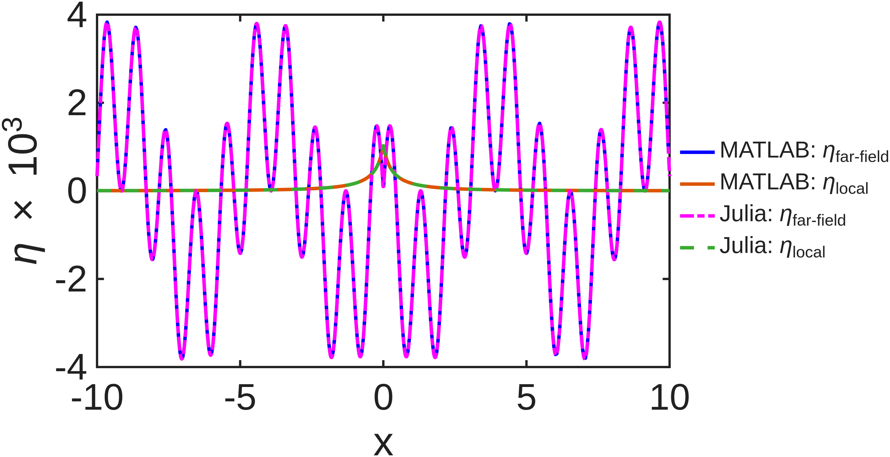

# ForcedInterfacialWaves.jl

*Julia implementation of the initial value problem (IVP) for pressure-forced interfacial waves in a two-fluid system. Please see the manuscript file below for details*

Based on:

> Kadari, V.K., Yewale, N., Farsoiya, P.K., Mayya, Y.S. & Dasgupta, R. (2026).
> Interfacial waves from pressure forcing: revisiting classical theories from an IVP perspective.
> *arXiv preprint* [arXiv:2605.12254](https://arxiv.org/abs/2605.12254).
## Citation

```bibtex
@article{kadari2026interfacial,
  title={Interfacial waves from pressure forcing: revisiting classical
         theories from an {IVP} perspective},
  author={Kadari, Vinod Kumar and Yewale, Nikhil and Farsoiya, Palas Kumar
          and Mayya, Y. S. and Dasgupta, Ratul},
  journal={arXiv preprint arXiv:2605.12254},
  year={2026}
}
```

## Problem


```@raw html
<figure style="text-align:center;">
  
  <figcaption>Figure 3 (manuscript): localised pressure forcing at the interface.</figcaption>
</figure>
```

As shown above (Fig. $3$ in the manuscript), a localised pressure $\tilde{p}_e = \tilde{F}_0\delta(\tilde{x})$ force is applied at the interface between two inviscid, incompressible, fluids of infinite depth, both streams moving at uniform speed $U$ rightwards. In the absence of this forcing, the interface is flat and remains at $\tilde{z}=0$. After non-dimensionalisation, the interfacial displacement resulting from the forcing i.e. $\eta(x,t)$ is obtained by evaluating the following time-dependent Fourier integrals (eqns. $3.7$ and $3.8$ in the manuscript)
```math
\begin{aligned}
\dfrac{\sqrt{2\pi}\;\bar{\eta}(k,t)}{F_0} &= \left(\dfrac{1}{-\alpha|k|^2 + \left(1+\rho_r\right)|k| - \left(1-\rho_r\right)}\right) \\
&\quad - \dfrac{1}{\alpha |k|^2 + \left(1 - \rho_r\right)} \left(\dfrac{k}{2}\right) \Bigg( \dfrac{\exp\left[-it\lambda_2(k)\right]}{\lambda_2(k)} + \dfrac{\exp\left[-it\lambda_1(k)\right]}{\lambda_1(k)} \Bigg) \tag{3.7}
\end{aligned}
```
The inverse Fourier integral, leads to the (non-dimensional) interface displacement as a function of time:
```math
\begin{aligned}
	\eta(x,t) = \dfrac{1}{\sqrt{2\pi}}\int_{-\infty}^{\infty}dk\;\exp\left(ikx\right)\bar{\eta}(k,t), 
  \end{aligned}  \tag{3.8}
```
where $\lambda_{1,2}(k) \equiv k\mp\sqrt{\dfrac{\alpha|k|^3}{1+\rho_r}\;+\;\beta|k|}$ and 

```math
\alpha = \frac{gT}{\rho_l U^4}, \quad
\rho_r = \frac{\rho_u}{\rho_l}, \quad
\beta = \frac{1-\rho_r}{1+\rho_r}.  
```

### Steady-state decomposition (manuscript §3.4)
In this section, the manuscript shows that neglecting the time-dependent terms in eqns. (3.7) and (3.8) and $\textit{without}$ using any Rayleigh dissipation, the steady-state response turns out to be (we exclude all the Dirac delta function terms in eqn. $3.9$ in the manuscript) the following. For proof of this, see [Steady-state proof](steady_proof.md).
```math
\begin{aligned}
\dfrac{\eta_{s}(x)}{F_0} =\dfrac{ \eta^{\text{far-field}}_{s}(x)}{F_0} + \dfrac{\eta^{\text{local}}_{s}(x)}{F_0},\tag{3.11}
\end{aligned}
```
where , 
```math
\begin{aligned}
\dfrac{\eta^{\text{far-field}}_{s}(x)}{F_0} \equiv \dfrac{1}{\alpha(k_l-k_s)}\bigg\{-\sin(k_s|x|)\quad + \quad \sin(k_l|x|)\bigg\} \\
\dfrac{\eta^{\text{local}}_{s}(x)}{F_0} \equiv  \dfrac{\left(k_l+k_s\right)}{\pi\alpha}\int_{0}^{\infty}dy \dfrac{y\exp\left(-|x|y\right)}{\left(y^2 + k_l^2\right)\left(y^2+k_s^2\right)},\quad x\neq 0
\end{aligned}
```
The integral expression for $\frac{\eta^{\text{local}}_{s}(x)}{F_0}$ above is solved numerically (in Julia and MATLAB) using the following codes:

```@raw html
<table style="width:100%"><tr>
<td style="vertical-align:top; width:50%">
<strong>Julia</strong>
<pre><code class="language-julia">using QuadGK, Plots
using ForcedInterfacialWaves

# Local manuscript-style alias for QuadGK.quadgk
const ∫ = quadgk

p = compute_cg_parameters()

# Spatial grid (nondimensional)
x = collect(-10:0.01:10)
filter!(xi -> abs(xi) > 1e-12, x)

# Far-field steady
η_far = @. p.F0 / (p.alpha * (p.k_l - p.k_s)) *
             (-sin(p.k_s * abs(x)) + sin(p.k_l * abs(x)))

# Local steady
η_local = similar(η_far)
for i in eachindex(x)
    integrand = y -> y * exp(-abs(x[i]) * y) /
        ((y^2 + p.k_l^2) * (y^2 + p.k_s^2))
    I, _ = ∫(integrand, 0.0, Inf;
                  atol=p.atol, rtol=p.rtol)
    η_local[i] = p.F0 * (p.k_l + p.k_s) /
                   (π * p.alpha) * I
end

# Plot (×10³)
plot(x, η_far .* 1e3,
     label="η_s^{far-field}", lw=1.5)
plot!(x, η_local .* 1e3,
      label="η_s^{local}", lw=1.5)
xlabel!("x"); ylabel!("η × 10³")
savefig("eta_steady_components.png")
</code></pre>
</td>
<td style="vertical-align:top; width:50%">
<strong>MATLAB</strong>
<pre><code class="language-matlab">% Parameters (CGS)
U = 26.7046; g = 981; T = 72;
rho_l = 1; rho_u = 0.001;
l_c = U^2/g;
alpha = T/(rho_l*U^2*l_c);
rho_r = rho_u/rho_l;
disc = (1+rho_r)^2 - 4*alpha*(1-rho_r);
k_l = ((1+rho_r) + sqrt(disc))/(2*alpha);
k_s = ((1+rho_r) - sqrt(disc))/(2*alpha);
F0 = 0.01*T / (rho_l*U^2*l_c);

% Spatial grid (nondimensional)
x = -10:0.01:10;
x(x == 0) = [];

% Far-field steady
eta_far = F0 / (alpha*(k_l - k_s)) * ...
    (-sin(k_s*abs(x)) + sin(k_l*abs(x)));

% Local steady
eta_local = zeros(size(x));
for i = 1:length(x)
    integrand = @(y) y .* exp(-abs(x(i)).*y) ...
        ./ ((y.^2+k_l^2) .* (y.^2+k_s^2));
    I = integral(integrand, 0, Inf, ...
        'AbsTol', 1e-10, 'RelTol', 1e-8);
    eta_local(i) = F0*(k_l+k_s)/(pi*alpha)*I;
end

% Plot (×10³)
figure; hold on;
plot(x, eta_far*1e3, 'b-', 'LineWidth', 1.5, ...
     'DisplayName', '\eta_s^{far-field}');
plot(x, eta_local*1e3, 'r-', 'LineWidth', 1.5, ...
     'DisplayName', '\eta_s^{local}');
xlabel('x'); ylabel('\eta \times 10^3');
legend('Location','best'); grid on;
</code></pre>
</td>
</tr></table>
```
The resulting figure from both Julia and MATLAB are superimposed  in the following figure, which is a reproduction of fig. $5a$ in the manuscript.


*Figure 5a: Comparison of steady wave profiles computed in MATLAB vs Julia.*

In eqn 3.11 , $\eta^{\text{local}}_{s}(x)$ ,  can be shown to be exactly equivalent to (for the proof, see [here](lamb_gx_equivalence.md)). 

$G(x) \equiv \dfrac{1}{k_{l}-k_{s}}\int_{0}^{\infty}\;dk\;\left(\dfrac{\cos(kx)}{k+k_{s}}-\dfrac{\cos(kx)}{k+k_{l}}\right)$

## Manuscript §4 :
### Zero capillarity limit ($\alpha=  0$) - section  §4.1 in the manuscript

```math
		\begin{align}
				\eta(x,t) &=& \eta_{s}(x) + \eta_{tr}^{(1)}(x,t) + \eta_{tr}^{(2)}(x,t), 
		\end{align}\tag{4.1}
```

```math
      \begin{align}	
        \dfrac{\eta_{s}(x)}{F_0} &\equiv \dfrac{1}{2\pi\left(1+\rho_r\right)}\int_{-\infty}^{\infty}dk\; \dfrac{\exp\left(ikx\right)}{|k| - \beta},\quad 0 < \beta \leq 1  \nonumber\\
        \dfrac{\eta_{tr}^{(1)}(x,t)}{F_0} &\equiv - \dfrac{1}{4\pi(1-\rho_r)}\int_{-\infty}^{\infty}dk\;\dfrac{k\;\exp\left[-i\left(k(t-x) + t\sqrt{\beta|k|}\right)\right]}{k+ \sqrt{\beta|k|}},  \nonumber\\
        \dfrac{\eta_{tr}^{(2)}(x,t)}{F_0} &\equiv - \dfrac{1}{4\pi(1-\rho_r)}\int_{-\infty}^{\infty}dk\;\dfrac{k\;\exp\left[-i\left(k(t-x) - t\sqrt{\beta|k|}\right)\right]}{k- \sqrt{\beta|k|}}. \tag{4.2a,b,c}
      \end{align} 
```
It may be further shown using principal value techniques that (see proof [here](pure_gravity_steady_proof.md))
```math
			\begin{align}
				\dfrac{\eta_{s}(x)}{F_0} &=& \dfrac{1}{\pi\left(1+\rho_r\right)}\left[-\pi\sin\left(\beta |x|\right)+\int_{0}^{\infty}dy\;\dfrac{y\exp\left(-|x|y\right)}{\beta^2 + y^2}\right],\quad 0 < \beta \leq 1,\; -\infty < x < \infty \nonumber \\
			\end{align} \tag{4.3}
```

$\eta_{s}(x)$ in expression (4.3) is a symmetric function of $x$, implying a symmetric response upstream and downstream of the forcing at $x=0$. However, a contribution to the steady-state *also comes* from the time-dependent term in eqns. (4.2b),(4.2c). As shown in the  proof([here](pure_gravity_transient_proof.md)) these transient terms may be further simplified to obtain the following analytical representation valid for all $x,t$ i.e.

```math
\begin{aligned}
\eta_{tr}(x,t) &\equiv \eta_{tr}^{(1)}(x,t) + \eta_{tr}^{(2)}(x,t) = \bigg\{\mathbb{T}_1(x) + \mathbb{T}_2(x,t) + \mathbb{T}_3(x,t) + \mathbb{T}_4(x,t)\bigg\}F_0, \quad\text{where}
\end{aligned}
```

**(4.4a)**
```math
\mathbb{T}_1(x)\equiv  \mp\left(\dfrac{1}{1+\rho_r}\right)\sin(\beta x),
```

**(4.4b)**
```math
\mathbb{T}_2(x,t) \equiv - \dfrac{4\beta^{-1}}{\pi\left(1+\rho_r\right)}\int_{0}^{\infty}dv\; v^2\;\dfrac{\exp\left(\mp 2av^2 \pm 2bv\right)}{\beta + \left(2v-\beta^{1/2}\right)^2}\Biggl\{\beta^{1/2}\cos\left(\beta^{1/2}tv\right)\pm
	\left(2v-\beta^{1/2}\right)\sin\left(\beta^{1/2}tv\right)\Biggr\},
```

**(4.4c)**
```math
\mathbb{T}_3(x,t)\equiv   \dfrac{\beta^{-1/2}}{\pi\left(1+\rho_r\right)}\left(1 + \dfrac{t}{2\left(t-x\right)}\right)\sqrt{\frac{\pi}{2|a|}}\left[\cos\left(\frac{b^2}{|a|}\right)\left\{\frac{1}{2}\mp \mathrm{C}\left(b\sqrt{\frac{2}{\pi |a|}}\right)\right\}+
	\sin\left(\frac{b^2}{|a|}\right)\left\{\frac{1}{2}\mp \mathrm{S}\left(b\sqrt{\frac{2}{\pi |a|}}\right)\right\}\right],
```

**(4.4d)**
```math
\mathbb{T}_4(x,t)\equiv  - \dfrac{1}{\pi\left(1+\rho_r\right)}\left[\int_{0}^{\infty}\;dv\dfrac{\cos\left(av^2 + 2bv\right)}{v + \beta^{1/2}}\right],
```

where $a \equiv t-x, \; b \equiv \dfrac{t\sqrt{\beta}}{2}$, the upper signs in $\mathbb{T}_1(x),\mathbb{T}_2(x,t)$ are used for $x<t$, while lower signs are for $x > t$. The Fresnel integrals $\mathrm{C}(\cdot)$ and $\mathrm{S}(\cdot)$ in eqn. (4.4c) are defined as

**(4.5)**
```math
\mathrm{C}\left(b\sqrt{\frac{2}{\pi |a|}}\right) \equiv  \int_{0}^{b\sqrt{\frac{2}{\pi |a|}}}dt\;  \cos\left(\frac{\pi t^2}{2}\right),\quad 
	\mathrm{S}\left(b\sqrt{\frac{2}{\pi |a|}}\right) \equiv  \int_{0}^{b\sqrt{\frac{2}{\pi |a|}}}dt\;  \sin\left(\frac{\pi t^2}{2}\right).
```

In expressions (4.4), the *time-independent term*, $\mathbb{T}_1(x)$ (eqn. 4.4a), is asymmetric with the same amplitude as the first term on the right hand side of eqn. (4.3). As a result, these two terms reinforce each other for $x>0$ but cancel for $x<0$. Further, we note that as $\rho_r\rightarrow 1$ $\left(\beta = \dfrac{1-\rho_r}{1 + \rho_r}\rightarrow 0\right)$, the terms diverge. This is physically reasonable because in this limit ($\rho_r\rightarrow 1$), gravity vanishes and in the absence of capillary forces as well (i.e. $\alpha=0$ that we are currently assuming), there remains no restoring force to resist deformation due to the external pressure. The analytical strategy is clear now: provided one can show that $\mathbb{T}_2(x,t\rightarrow\infty)\rightarrow0$, $\mathbb{T}_3(x,t\rightarrow\infty)\rightarrow0$ and $\mathbb{T}_4(x,t\rightarrow\infty)\rightarrow0$, one obtains the expected steady-state lacking waves upstream (except for small localised deformation of the interface due to the localised integral in eqn. (4.3)) and sinusoidal waves downstream ($x>0$) with wavenumber $\beta$.

### Finite-capillarity : ($\alpha > 0$) section §4.2 in the manuscript


This package evaluates these integrals numerically for two physical regimes:

| Case | Surface tension | Poles | Figure |
|:-----|:--------------:|:------|:------:|
| Pure gravity ($\alpha = 0$) | absent | CPV at $k = \beta$ | 6 |
| Capillary–gravity ($\alpha > 0$) | active | Removable at $k_s$, $k_l$ (combined integrand cancels) | 10 |

## What the code computes

**Pure gravity (α = 0):** The solution is decomposed analytically into $T_0$ (steady), $T_1^\pm$–$T_4^\pm$ (transient), where $T_3$ uses the Fresnel cosine and sine integrals (evaluated in closed form via `FresnelIntegrals.jl`, no quadrature). An independent direct numerical Cauchy principal value (CPV) evaluation verifies the analytical decomposition.

**Capillary–gravity (α > 0):** The combined integrand $\mathbb{I}(k; x, t)$ — which sums the steady part $\eta_s$ and the two transient integrands $\mathbb{I}_3$, $\mathbb{I}_4$ so that their singularities at the gravity root $k_s$ and capillary root $k_l$ cancel — is integrated over $[0,\infty)$ split around both poles. The classical steady solution via residues and a $G(x)$ integral is also computed for large-time comparison.


## Quick start
### Install julia from terminal 
```julia
curl -fsSL https://install.julialang.org | sh
```
```julia
using ForcedInterfacialWaves

# ─── Pure gravity ───
pg = compute_gravity_parameters()       # returns PureGravityParams struct
t_pg = 1.0 / pg.t_c

# Analytical decomposition (left of wavefront):
η_total, η_steady, η_transient = gravity_analytical_left(-2.0, t_pg, pg)

# Independent numerical CPV verification:
η_cpv = gravity_numerical_cpv(-2.0, t_pg, pg)

# Individual T-terms for validation:
T0 = gravity_T0(-2.0, pg)
T3 = gravity_T3_left(-2.0, t_pg, t_pg + 2.0, pg)  # uses fresnelc/fresnels

# ─── Capillary–gravity parameters (all CGS, matching the paper) ───
p = compute_cg_parameters()   # returns CapillaryGravityParams struct

# Evaluate the IVP surface displacement at a single (x, t) point:
η = ivp_surface_elevation(3.0, 110.0, p)

# Compute a full spatial profile using threaded vector-valued quadrature:
x_grid = make_cg_xgrid(p; Nx=2001)
t = 3.0 / p.t_c                        # t_dim = 3 s → nondimensional
η_ivp    = compute_cg_ivp_profile(x_grid, t, p)
η_steady = compute_cg_steady_profile(x_grid, p)
```

## Generating the paper figures

```bash
julia -t auto --project=. scripts/figure6_pure_gravity.jl
julia -t auto --project=. scripts/figure10_capillary_gravity.jl
```

## Contents

```@contents
Pages = ["theory.md", "julia_matlab.md", "validation.md", "api.md"]
Depth = 2
```

