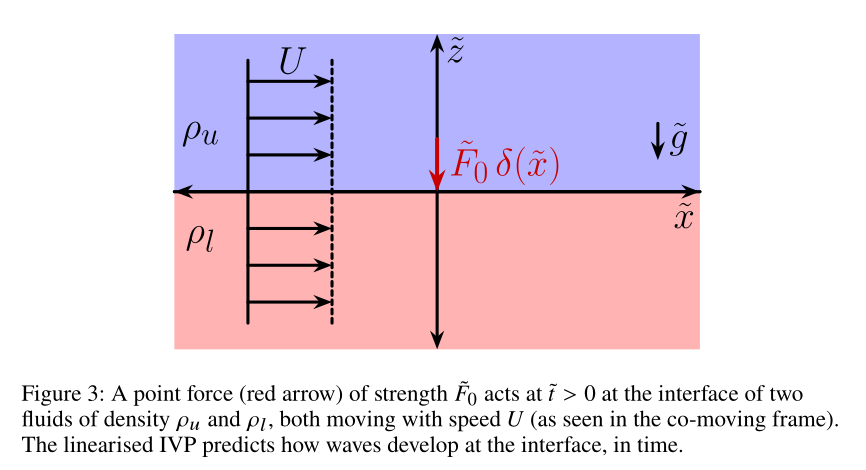

# WavesDelta.jl

*Julia implementation of the initial value problem (IVP) for pressure-forced interfacial waves in a two-fluid system. Please see the manuscript file below for details*

Based on:

> Kadari, V.K., Yewale, N., Farsoiya, P.K., Mayya, Y.S. & Dasgupta, R. (2026).
> Interfacial waves from pressure forcing: revisiting classical theories from an IVP perspective.
> *arXiv preprint* [arXiv:2605.12254](https://arxiv.org/abs/2605.12254).

## Problem




As shown above (Fig. $3$ in the manuscript), a localised pressure $\tilde{p}_e = \tilde{F}_0\delta(\tilde{x})$ force is applied at the interface between two inviscid, incompressible, fluids of infinite depth, both streams moving at uniform speed $U$ rightwards. In the absence of this forcing, the interface is flat and remains at $\tilde{z}=0$. After non-dimensionalisation, the interfacial displacement resulting from the forcing i.e. $\eta(x,t)$ is obtained by evaluating the following time-dependent Fourier integrals (eqns. $3.7$ and $3.8$ in the manuscript)
```math
\begin{aligned}
\dfrac{\sqrt{2\pi}\;\bar{\eta}(k,t)}{F_0} &= \left(\dfrac{1}{-\alpha|k|^2 + \left(1+\rho_r\right)|k| - \left(1-\rho_r\right)}\right) \\
&\quad - \dfrac{1}{\alpha |k|^2 + \left(1 - \rho_r\right)} \left(\dfrac{k}{2}\right) \Bigg( \dfrac{\exp\left[-it\lambda_2(k)\right]}{\lambda_2(k)} + \dfrac{\exp\left[-it\lambda_1(k)\right]}{\lambda_1(k)} \Bigg) \tag{3.7}
\end{aligned}
```
The inverse Fourier integral, leads to the (non-dimensional) interface displacement as a function of time:
```math
\begin{aligned}
	\eta(x,t) = \dfrac{1}{\sqrt{2\pi}}\int_{-\infty}^{\infty}dk\;\exp\left(ikx\right)\bar{\eta}(k,t), 
  \end{aligned}  \tag{3.8}
```
where $\lambda_{1,2}(k) \equiv k\mp\sqrt{\dfrac{\alpha|k|^3}{1+\rho_r}\;+\;\beta|k|}$ and 

```math
\alpha = \frac{gT}{\rho_l U^4}, \quad
\rho_r = \frac{\rho_u}{\rho_l}, \quad
\beta = \frac{1-\rho_r}{1+\rho_r}.  
```
This package evaluates these integrals numerically for two physical regimes:

| Case | Surface tension | Poles | Figure |
|:-----|:--------------:|:------|:------:|
| Pure gravity ($\alpha = 0$) | absent | CPV at $k = \beta$ | 6 |
| Capillary–gravity ($\alpha > 0$) | active | Removable at $k_s$, $k_l$ (combined integrand cancels) | 10 |

## What the code computes

**Pure gravity (α = 0):** The solution is decomposed analytically into $T_0$ (steady), $T_1^\pm$–$T_4^\pm$ (transient), where $T_3$ uses the Fresnel cosine and sine integrals (evaluated in closed form via `FresnelIntegrals.jl`, no quadrature). An independent direct numerical Cauchy principal value (CPV) evaluation verifies the analytical decomposition.

**Capillary–gravity (α > 0):** The combined integrand $\mathbb{I}(k; x, t)$ — which sums the steady part $\eta_s$ and the two transient integrands $\mathbb{I}_3$, $\mathbb{I}_4$ so that their singularities at the gravity root $k_s$ and capillary root $k_l$ cancel — is integrated over $[0,\infty)$ split around both poles. The classical steady solution via residues and a $G(x)$ integral is also computed for large-time comparison.

## Quick start
### Install julia from terminal 
```julia
curl -fsSL https://install.julialang.org | sh
```
```julia
using WavesDelta

# ─── Pure gravity ───
pg = compute_gravity_parameters()       # returns PureGravityParams struct
t_pg = 1.0 / pg.t_c

# Analytical decomposition (left of wavefront):
η_total, η_steady, η_transient = gravity_analytical_left(-2.0, t_pg, pg)

# Independent numerical CPV verification:
η_cpv = gravity_numerical_cpv(-2.0, t_pg, pg)

# Individual T-terms for validation:
T0 = gravity_T0(-2.0, pg)
T3 = gravity_T3_left(-2.0, t_pg, t_pg + 2.0, pg)  # uses fresnelc/fresnels

# ─── Capillary–gravity parameters (all CGS, matching the paper) ───
p = compute_cg_parameters()   # returns CapillaryGravityParams struct

# Evaluate the IVP surface displacement at a single (x, t) point:
η = ivp_surface_elevation(3.0, 110.0, p)

# Compute a full spatial profile using threaded vector-valued quadrature:
x_grid = make_cg_xgrid(p; Nx=2001)
t = 3.0 / p.t_c                        # t_dim = 3 s → nondimensional
η_ivp    = compute_cg_ivp_profile(x_grid, t, p)
η_steady = compute_cg_steady_profile(x_grid, p)
```

## Generating the paper figures

```bash
julia -t auto --project=. scripts/figure6_pure_gravity.jl
julia -t auto --project=. scripts/figure10_capillary_gravity.jl
```

## Contents

```@contents
Pages = ["theory.md", "julia_matlab.md", "validation.md", "api.md"]
Depth = 2
```

## Citation

```bibtex
@article{kadari2026interfacial,
  title={Interfacial waves from pressure forcing: revisiting classical
         theories from an {IVP} perspective},
  author={Kadari, Vinod Kumar and Yewale, Nikhil and Farsoiya, Palas Kumar
          and Mayya, Y. S. and Dasgupta, Ratul},
  journal={arXiv preprint arXiv:2605.12254},
  year={2026}
}
```
