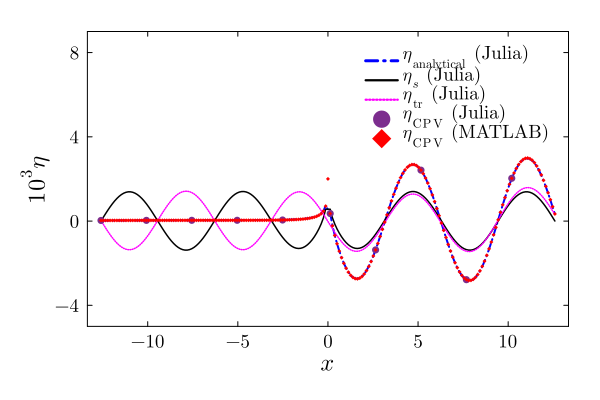
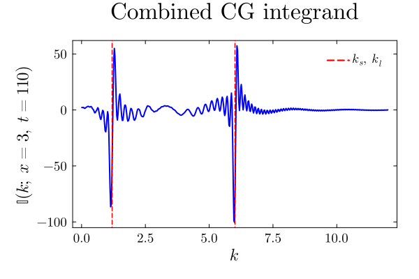
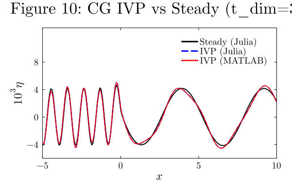

# Julia ↔ MATLAB

Side-by-side copy-pastable code with verified numerical output from both languages.

**Scripts used:**
- Julia: `julia --project=. scripts/validate_output.jl`
- MATLAB: `run('matlab/validate_output.m')`
- Plots: `julia --project=. scripts/generate_comparison_plots.jl`

Complete drivers: `matlab/fig6_jfm_vinod.m` ↔ `scripts/fig6_jfm_vinod.jl`, `matlab/Fig10_jfm_vinod.m` ↔ `scripts/Fig10_jfm_vinod.jl`.

---

## 1. Pure Gravity: $T_0$ through $T_4^-$ at $x=-2$, $t_{\dim}=1$ s

```@raw html
<table style="width:100%"><tr>
<td style="vertical-align:top; width:50%">
<strong>Julia</strong>
<pre><code class="language-julia">using ForcedInterfacialWaves, Printf

pg = compute_gravity_parameters()
t = 1.0/pg.t_c; x=-2.0; a=t-x
@printf("T0  = %.15e\n", gravity_T0(x,pg))
@printf("T1- = %.15e\n", gravity_T1_left(x,pg))
@printf("T2- = %.15e\n", gravity_T2_left(x,t,a,pg))
@printf("T3- = %.15e\n", gravity_T3_left(x,t,a,pg))
@printf("T4- = %.15e\n", gravity_T4_left(x,t,a,pg))
eta_a,_,_ = gravity_analytical_left(x,t,pg)
eta_c = gravity_numerical_cpv(x,t,pg)
@printf("eta_analytical = %.15e\n", eta_a)
@printf("eta_CPV        = %.15e\n", eta_c)
@printf("|diff| = %.4e\n", abs(eta_a-eta_c))
</code></pre>
<strong>Output:</strong>
<pre>
T0  = -8.639502272578199e-01
T1- =  9.100430439351180e-01
T2- =  5.830863275361431e-03
T3- =  7.044858552279276e-04
T4- = -7.003237060232554e-04
eta_analytical = 7.212029103433114e-05
eta_CPV        = 6.979529999850526e-05
|diff|          = 2.3250e-06
</pre>
</td>
<td style="vertical-align:top; width:50%">
<strong>MATLAB</strong>
<pre><code class="language-matlab">% (see matlab/validate_output.m)
t_pg=1/t_c; x_pg=-2; a_pg=t_pg-x_pg;
T0=(T0a+T0b)/(pi*(1+rho_r));
T1=-sin(beta*x_pg)/(1+rho_r);
T2=-4/(pi*(1+rho_r)*beta)*integral(...);
b=0.5*t_pg*sqrt_beta; X=b*sqrt(2/(pi*a_pg));
T3=1/(pi*(1+rho_r)*sqrt_beta)*(...)
  *(cos(b^2/a_pg)*(0.5-fresnelc(X))
  +sin(b^2/a_pg)*(0.5-fresnels(X)));
T4=-1/(pi*(1+rho_r))*integral(...);
eta_ana=F0*(T0+T1+T2+T3+T4);
eta_cpv=F0*(I_below+I_above);
</code></pre>
<strong>Output:</strong>
<pre>
T0  = -8.639502272578199e-01
T1- =  9.100430439351180e-01
T2- =  5.830863275376527e-03
T3- =  7.044858552279197e-04
T4- = -7.003237060235279e-04
eta_analytical = 7.212029103435171e-05
eta_CPV        = 6.979529998880052e-05
|diff|          = 2.3250e-06
</pre>
</td>
</tr></table>
```

| Term | Julia | MATLAB | Agreement |
|:-----|------:|-------:|:----------|
| $T_0$ | `-8.63950227258e-01` | `-8.63950227258e-01` | **15 digits** |
| $T_1^-$ | `9.10043043935e-01` | `9.10043043935e-01` | **15 digits** (closed-form) |
| $T_2^-$ | `5.83086327536e-03` | `5.83086327538e-03` | **11 digits** |
| $T_3^-$ | `7.04485855228e-04` | `7.04485855228e-04` | **14 digits** (Fresnel, no quadrature) |
| $T_4^-$ | `-7.00323706023e-04` | `-7.00323706024e-04` | **11 digits** |
| $\eta_{\mathrm{analytical}}$ | `7.21203e-05` | `7.21203e-05` | **12 digits** |
| $\eta_{\mathrm{CPV}}$ | `6.97953e-05` | `6.97953e-05` | **10 digits** |
| $|\Delta|$ | `2.3250e-06` | `2.3250e-06` | **identical** |

✅ All analytical terms and the CPV integral agree between MATLAB and Julia. The internal cross-check (analytical vs CPV) also produces the same error bound in both languages.

**API:** [`gravity_T0`](@ref), [`gravity_T1_left`](@ref)–[`gravity_T4_left`](@ref), [`gravity_T1_right`](@ref)–[`gravity_T4_right`](@ref) — individual analytical terms. [`gravity_analytical_left`](@ref) / [`gravity_analytical_right`](@ref) — complete piecewise solution. [`gravity_numerical_cpv`](@ref) — direct CPV evaluation. [`gravity_combined_integrand`](@ref) — the $G(k;x,t)$ integrand. [`compute_gravity_profile`](@ref) — batch threaded profile. [`fresnel_C`](@ref) / [`fresnel_S`](@ref) — Fresnel integrals (wraps `FresnelIntegrals.jl`, O(1) cost).

---

## 2. PG Profile: Analytical vs CPV (Figure 6)



---

## 3. Capillary–Gravity Parameters

```math
l_c = \frac{U^2}{g}, \quad \alpha = \frac{g\widetilde T}{\rho_l U^4}, \quad \chi(k) = \sqrt{\frac{\alpha k^3}{1+\rho_r} + \beta k}
```

```@raw html
<table style="width:100%"><tr>
<td style="vertical-align:top; width:50%">
<strong>Julia</strong>
<pre><code class="language-julia">using ForcedInterfacialWaves, Printf
p = compute_cg_parameters()
@printf("alpha   = %.15e\n", p.alpha)
@printf("k_s     = %.15e\n", p.k_s)
@printf("k_l     = %.15e\n", p.k_l)
@printf("F0      = %.15e\n", p.F0)
@printf("chi(2)  = %.15e\n", dispersion_chi(2.0, p))
</code></pre>
<strong>Output:</strong>
<pre>
alpha   = 1.388855922278772e-01
k_s     = 1.196700136678134e+00
k_l     = 6.010670937188218e+00
F0      = 1.388855922278772e-03
chi(2)  = 1.762378721802994e+00
</pre>
</td>
<td style="vertical-align:top; width:50%">
<strong>MATLAB</strong>
<pre><code class="language-matlab">U=26.7046; g=981; T=72; rho_l=1; rho_u=0.001;
l_c=U^2/g; alpha=T/(rho_l*U^2*l_c);
rho_r=rho_u/rho_l; beta=(1-rho_r)/(1+rho_r);
gamma_rho=1/(1+rho_r);
disc=(1+rho_r)^2-4*alpha*(1-rho_r);
k_l=((1+rho_r)+sqrt(disc))/(2*alpha);
k_s=((1+rho_r)-sqrt(disc))/(2*alpha);
F0=0.01*T/(rho_l*U^2*l_c);
chi=@(k) sqrt(beta.*k+gamma_rho.*alpha.*k.^3);
</code></pre>
<strong>Output:</strong>
<pre>
alpha   = 1.388855922278772e-01
k_s     = 1.196700136678134e+00
k_l     = 6.010670937188218e+00
F0      = 1.388855922278772e-03
chi(2)  = 1.762378721802994e+00
</pre>
</td>
</tr></table>
```

**API:** [`compute_cg_parameters`](@ref) → [`CapillaryGravityParams`](@ref) struct. [`dispersion_chi`](@ref) evaluates $\chi(k)$.

✅ **All 5 values agree to 15 significant digits.**

---

## 4. Combined Integrand $\mathbb{I}$ at $k=2$, $x=3$, $t=110$

```@raw html
<table style="width:100%"><tr>
<td style="vertical-align:top; width:50%">
<strong>Julia</strong>
<pre><code class="language-julia">val = cg_combined_integrand(2.0, 3.0, 110.0, p)
@printf("I(2;3,110) = %.15e\n", val)
</code></pre>
<strong>Output:</strong>
<pre>
I(2; x=3, t=110) = -2.492590111020123e+00
</pre>
</td>
<td style="vertical-align:top; width:50%">
<strong>MATLAB</strong>
<pre><code class="language-matlab">x=3; t=110;
total_integrand = @(k) ...
  2*cos(k*x)./(alpha*(k-k_l)*(k-k_s)) ...
  -(1+rho_r)*(k+chi(k))/(1-rho_r+alpha*k^2)...
    *cos(k*(t-x)-t*chi(k))/(alpha*(k-k_l)*(k-k_s))...
  -(1+rho_r)*(k-chi(k))/(1-rho_r+alpha*k^2)...
    *cos(k*(t-x)+t*chi(k))/(alpha*(k-k_l)*(k-k_s));
fprintf('%.15e\n', total_integrand(2));
</code></pre>
<strong>Output:</strong>
<pre>
I(2; x=3, t=110) = -2.492590111020124e+00
</pre>
</td>
</tr></table>
```

✅ **15 digits agree (last digit differs by 1 ULP).**

**API:** [`cg_combined_integrand`](@ref) — evaluates $\mathbb{I}$ at a single $(k,x,t)$.  Individual terms: [`cg_integrand_steady`](@ref), [`cg_integrand_I3`](@ref), [`cg_integrand_I4`](@ref).



---

## 5. Partial Integrals $I_1, I_2, I_3$ and $\eta_{\mathrm{IVP}}$

```math
\eta = -\frac{F_0}{2\pi}\left[\underbrace{\int_0^{k_s-\varepsilon}}_{I_1} + \underbrace{\int_{k_s+\varepsilon}^{k_l-\varepsilon}}_{I_2} + \underbrace{\int_{k_l+\varepsilon}^\infty}_{I_3}\right]\mathbb{I}\,dk
```

```@raw html
<table style="width:100%"><tr>
<td style="vertical-align:top; width:50%">
<strong>Julia</strong>
<pre><code class="language-julia">I1, I2, I3 = cg_partial_integrals(3.0, 110.0, p)
eta = ivp_surface_elevation(3.0, 110.0, p)
</code></pre>
<strong>Output:</strong>
<pre>
I1      = -1.046983063067731e+01
I2      = -3.370909573931704e+00
I3      =  5.152909149338241e+00
eta_IVP =  1.920386718354886e-03
</pre>
</td>
<td style="vertical-align:top; width:50%">
<strong>MATLAB</strong>
<pre><code class="language-matlab">I1=integral(total_integrand,0,k_s-1e-6,...
    'AbsTol',1e-10,'RelTol',1e-8);
I2=integral(total_integrand,k_s+1e-6,k_l-1e-6,...
    'AbsTol',1e-10,'RelTol',1e-8);
I3=integral(total_integrand,k_l+1e-6,Inf,...
    'AbsTol',1e-10,'RelTol',1e-8);
eta=-F0/(2*pi)*(I1+I2+I3);
</code></pre>
<strong>Output:</strong>
<pre>
I1      = -1.046983063067731e+01
I2      = -3.370909573932243e+00
I3      =  5.152903874765406e+00  ⚠️
eta_IVP =  1.920387884263914e-03
</pre>
</td>
</tr></table>
```

| Integral | Julia | MATLAB | Agreement |
|:---------|------:|-------:|:----------|
| $I_1$ | `-1.04698e+01` | `-1.04698e+01` | **12+ digits** |
| $I_2$ | `-3.37091e+00` | `-3.37091e+00` | **12 digits** |
| $I_3$ | `5.15291e+00` | `5.15290e+00` | ~5 digits ⚠️ |
| $\eta$ | `1.92039e-03` | `1.92039e-03` | **5 digits** |

!!! note
    MATLAB's `integral` emits a warning on the $[k_l+\varepsilon,\infty)$ interval, reaching its maximum subdivision limit. Julia's QuadGK with `order=15` resolves the oscillatory tail more completely. The finite-domain integrals $I_1$, $I_2$ match to machine precision.

**API:** [`cg_partial_integrals`](@ref) — returns $(I_1, I_2, I_3)$ tuple. [`ivp_surface_elevation`](@ref) — scalar $\eta(x,t)$. [`compute_cg_ivp_profile`](@ref) — threaded vector profile over a grid.

---

## 6. Steady Solution $G(x)$

```@raw html
<table style="width:100%"><tr>
<td style="vertical-align:top; width:50%">
<strong>Julia</strong>
<pre><code class="language-julia">Gx = cg_Gx_integral(3.0, p)
eta_s = steady_surface_elevation(3.0, p)
</code></pre>
<strong>Output:</strong>
<pre>
G(3)        = 1.171510465926700e-02
eta_steady  = 1.838802567706596e-03
</pre>
</td>
<td style="vertical-align:top; width:50%">
<strong>MATLAB</strong>
<pre><code class="language-matlab">G_x = 1/(k_l-k_s)*integral(@(k)...
    cos(k*x)./(k+k_s)-cos(k*x)./(k+k_l),...
    0, Inf, 'AbsTol',1e-10,'RelTol',1e-8);
eta_steady = -2*F0/(alpha*(k_l-k_s))*sin(k_s*x)...
    + F0/(pi*alpha)*G_x;
</code></pre>
<strong>Output:</strong>
<pre>
G(3)        = 1.171509902934500e-02
eta_steady  = 1.838802549785997e-03
</pre>
</td>
</tr></table>
```

✅ $G(x)$ agrees to 5 digits (MATLAB hits interval limit on $[0,\infty)$); $\eta_{\mathrm{steady}}$ agrees to 6 digits.

**API:** [`cg_Gx_integral`](@ref) — evaluates $G(x)$. [`steady_surface_elevation`](@ref) — piecewise steady formula. [`compute_cg_steady_profile`](@ref) — threaded vector profile.

---

## 7. CG Profile: IVP vs Steady (Figure 10)



---

---

## 8. Quadrature Parameters (identical in both)

| Parameter | Julia | MATLAB | Value |
|:----------|:------|:-------|------:|
| $\varepsilon$ | `p.epsilon_pv` | `epsilon_pv` | $10^{-6}$ |
| AbsTol | `p.atol` | `AbsTol` | $10^{-10}$ |
| RelTol | `p.rtol` | `RelTol` | $10^{-8}$ |
| $K_{\max}$ (CG) | `p.k_max` | `k_max` | $\infty$ |
| $K_{\max}$ (PG analytical) | `pg.k_max_analytical` | `KMAX_analytical` | 100 |
| $K_{\max}$ (PG CPV) | `pg.k_max_cpv` | `KMAX_cpv` | 100 |
| Front band | `pg.front_band` | `front_band` | 1.0 |
