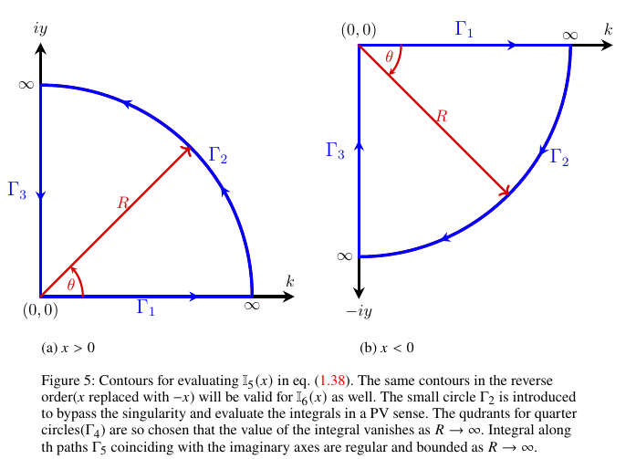

# Proof: Equivalence between the local contribution $\eta_s^{local}(x)$ and Lamb's local function $G(x)$

Lamb's local function $G(x)$ is given by the classical steady-state result. This function may be shown to be exactly the same as the exponential-decay ($\eta_s^{local}(x)$) term in the time-independent solution of the present Initial Value Problem (IVP), given in eqn. (3.11) in the manuscript. This is shown here by applying the Cauchy-residue theorem to $G(x)$.

Combine the two cosine integrals in $G(x)$ (see, eqn.(D8) in Appendix D in manuscript) into a single integral of $\cos(kx)$:

```math
G(x) = \int_{0}^{\infty} dk\, \frac{\cos(kx)}{(k+k_s)(k+k_l)}.
\tag{L.1}
```

Writing the cosine as its exponential form and splitting the integral gives

```math
G(x) = \frac{1}{2}\left[\mathbb{I}_{11}(x) + \mathbb{I}_{12}(x)\right],
\tag{L.2}
```

where

```math
\mathbb{I}_{11}(x) = \int_{0}^{\infty} dk\, \frac{\exp\left(ikx\right)}{(k+k_s)(k+k_l)},
\tag{L.3}
```

```math
\mathbb{I}_{12}(x) = \int_{0}^{\infty} dk\, \frac{\exp\left(-ikx\right)}{(k+k_s)(k+k_l)}.
\tag{L.4}
```

The integrals $\mathbb{I}_{11}(x)$ and $\mathbb{I}_{12}(x)$ may be evaluated by contour integration using the Cauchy-residue theorem. The corresponding closed contours (Figure 5(a) for $x>0$ and Figure 5(b) for $x<0$) enclose no poles, since $-k_s$ and $-k_l$ lie outside the first/fourth quadrant quarter-circle contours used here.



---

Consider the integral $\mathbb{I}_{11}^c(x)$ along the closed contour (Figure 5(a)) for $x>0$,

```math
\mathbb{I}_{11}^{\,c}(x) = \oint dz\, \frac{\exp\left(izx\right)}{(z+k_s)(z+k_l)}.
\tag{L.5}
```

The integral $\mathbb{I}_{11}^c(x)$ will be zero as the closed contour does not enclose any poles. Breaking the integral along the individual contour segments,

```math
\mathbb{I}_{11}^c(x) = 0 = \int_{\Gamma_1} dz\, \frac{\exp\left(izx\right)}{(z+k_s)(z+k_l)}
	+\int_{\Gamma_2} dz\,\frac{\exp\left(izx\right)}{(z+k_s)(z+k_l)}
	+\int_{\Gamma_3} dz\, \frac{\exp\left(izx\right)}{(z+k_s)(z+k_l)}.
	\tag{L.6}
```

The integral on the large quarter circle $\Gamma_2$ tends to zero as $R \to \infty$ for $x>0$, as argued below,

```math
\lim_{R\rightarrow\infty}\left[\mathbb{I}_{11}^{\,c}(x)\right]
	=
	\lim_{R\rightarrow\infty}
	\left[\oint d\theta\,
	iR\exp(i\theta)\,
	\frac{\exp\left(ixR\cos\theta\right)\,\exp\left(-xR\sin\theta\right)}
	{\left(R\exp(i\theta)+k_s\right)\left(R\exp(i\theta)+k_l\right)}\right].
	\tag{L.7}
```

The value of the integrand above is governed by the factor $\exp(-xR\sin\theta)$, which tends to zero as $R \to \infty$ for $x>0$ by Jordan's lemma, since $\sin(\theta)$ is always positive in the first quadrant. In view of this, eqn. (L.6) reduces to,

```math
\lim_{R\rightarrow\infty}\left[\int_{0}^{R}  dk\,\frac{\exp\left(ikx\right)}{(k+k_s)(k+k_l)}-i\int_{0}^{R} dy\,
	\frac{\exp\left(-yx\right)}{(iy+k_s)(iy+k_l)}\right]=0.
	\tag{L.8}
```

Upon completing the limiting process, the above equation can be rewritten to obtain

```math
\mathbb{I}_{11}(x)=\int_{0}^{\infty} dk\,\frac{\exp\left(ikx\right)}{(k+k_s)(k+k_l)}
	=
	i\int_{0}^{\infty} dy\,
	\frac{\exp\left(-yx\right)}{(iy+k_s)(iy+k_l)}, \qquad x>0.
	\tag{L.9}
```

Similarly, for $x<0$ one performs similar steps of contour integration using the contour in Figure 5(b) and obtains,

```math
\mathbb{I}_{11}(x)=\int_{0}^{\infty} dk\,\frac{\exp\left(ikx\right)}{(k+k_s)(k+k_l)}
	=
	-i\int_{0}^{\infty} dy\,
	\frac{\exp\left(yx\right)}{(iy-k_s)(iy-k_l)}, \qquad x<0.
	\tag{L.10}
```

The integral $\mathbb{I}_{12}(x)$ in eqn. (L.4) is the same as $\mathbb{I}_{11}(x)$ with $x$ replaced with $-x$, accordingly one may write

```math
\mathbb{I}_{12}(x)=\int_{0}^{\infty} dk\,\frac{\exp\left(-ikx\right)}{(k+k_s)(k+k_l)}
	=-i\int_{0}^{\infty} dy\,
	\frac{\exp\left(-yx\right)}{(iy-k_s)(iy-k_l)}
	, \qquad x>0,
	\tag{L.11}
```

and

```math
\mathbb{I}_{12}(x)=\int_{0}^{\infty} dk\,\frac{\exp\left(-ikx\right)}{(k+k_s)(k+k_l)}
	=
	i\int_{0}^{\infty} dy\,
	\frac{\exp\left(yx\right)}{(iy+k_s)(iy+k_l)}, \qquad x<0.
	\tag{L.12}
```

Upon plugging eqns. (L.9)–(L.12) into eqn. (L.2) and separating the real and imaginary parts (the latter vanishes), one obtains

```math
G(x)=
	(k_l+k_s)\int_{0}^{\infty} dy\,
	\frac{y\,\exp\left(-y|x|\right)}{(y^2+k_s^2)(y^2+k_l^2)}\,, \quad x \neq 0.
	\tag{L.13}
```

Eqn. (L.13), obtained from Lamb's local function $G(x)$, is exactly the same as the local contribution in the present steady solution — compare with the exponential term in eqns. (3.11) and (4.6) in the manuscript. Furthermore, it has already been shown analytically that the far-field component of the present steady solution is exactly the same as Lamb's result (compare eqns. (4.6) and (4.7) with eqn. (D 8) in manuscript). Hence it is proved analytically that the long-time limit of the present IVP solution is exactly the same as Lamb's steady solution.
