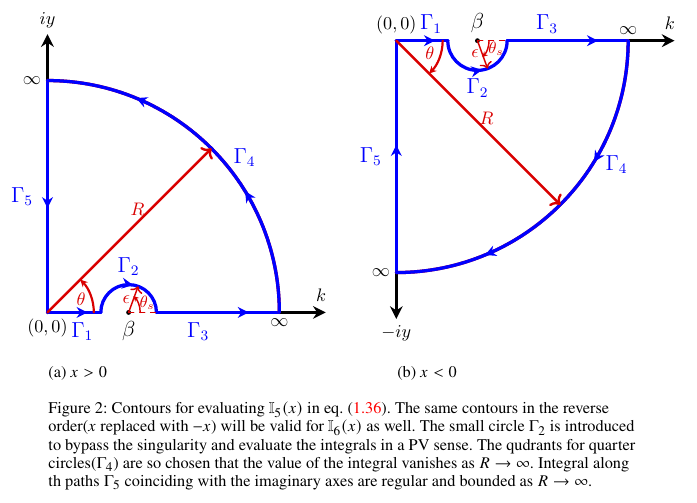

# Proof: Steady-state solution for pure gravity ($\alpha = 0$)

## Evaluation of time-independent term $\eta_{s}(x)$

Let us first focus on the time-independent part $\eta_s(x)$. This can be rewritten as:

**(P.1)**
```math
\frac{\eta_{s}(x)}{F_0} =  \frac{1}{2\pi (1+\rho_r)}\left\{\mathbb{I}_5(x)+\mathbb{I}_6(x)\right\},
```

where, we define,

**(P.2)**
```math
\mathbb{I}_5(x) = \int_{0}^{\infty}dk\;\dfrac{\exp\left(ikx\right)}{k - \beta}, \qquad -\infty < x < \infty,
```

**(P.3)**
```math
\mathbb{I}_6(x) = \int_{0}^{\infty}dk\;\dfrac{\exp\left(-ikx\right)}{k - \beta},
	\qquad -\infty < x < \infty.
```



---

The integrals $\mathbb{I}_5(x)$ and $\mathbb{I}_6(x)$ are singular at $k=\beta$, lying along the line of integration, as shown in Figure 2.
Hence we interpret them to exist in a Principal Value (PV) sense.
They may be evaluated by contour integration using the PV method, with the contours shown in Figure 2.

The PV of an integral $I=\int_{0}^{\infty} f(x)\,dx$, where $f(x)$ possesses a simple first-order pole at $x=x_0$ ($x_0 \in \mathbb{R}^{+}$), is defined as

**(P.4)**
```math
I=\operatorname{PV}\int_{0}^{\infty} f(x)\,dx
=\displaystyle \lim_{\epsilon \to 0}
\left[
\int_{0}^{x_0-\epsilon} f(x)\,dx
+
\int_{x_0+\epsilon}^{\infty} f(x)\,dx
\right],
```
if such a limit exists.

Consider the integral $\mathbb{I}_5^c(x)$ along the closed contour shown in Figure 2(a) for $x>0$,

**(P.5)**
```math
\mathbb{I}_5^c(x) = \oint dz \,  \frac{\exp\left(izx\right)}{(z - \beta)}, \qquad x>0.
```

$\mathbb{I}_5^c(x)$ will be zero as the closed contour does not enclose any singularity. Further, upon breaking this integral along the individual segments of the contour, one may write as

**(P.6)**
```math
\mathbb{I}_5^c(x) = 0 =	\int_{\Gamma_1} dz\, \frac{\exp(izx)}{z-\beta}
	+\int_{\Gamma_2} dz\, \frac{\exp(izx)}{z-\beta}
	+\int_{\Gamma_3} dz\, \frac{\exp(izx)}{z-\beta}
	+\int_{\Gamma_4} dz\, \frac{\exp(izx)}{z-\beta}
	+\int_{\Gamma_5} dz\, \frac{\exp(izx)}{z-\beta}.
```

The integral on the large quarter circle $\Gamma_4$ tends to zero as $R \to \infty$ for $x>0$, as argued below,

**(P.7)**
```math
\lim_{R \rightarrow \infty}\left[\int_{\Gamma_4} dz\, \frac{\exp(izx)}{z-\beta}\right]=\lim_{R \rightarrow \infty} \left[\int_{0}^{\frac{\pi}{2}} d\theta \, iR \exp(i \theta) \frac{\exp\left(ixR \cos(\theta)\right)\exp\left(-xR \sin(\theta)\right)}{(R \exp(i \theta) - \beta)} \right],
```

the value of the integrand above is governed by the factor $\exp(-xR\sin\theta)$ which tends to zero as $R \to \infty$ for $x>0$ by Jordan's lemma, since $\sin(\theta)$ is always positive in the first quadrant. In view of this, eqn. (P.6) reduces to,

**(P.8)**
```math
\begin{aligned}
	&\lim_{\substack{\epsilon \to 0 \\ R \to \infty}} \left[\int_{0}^{\beta-\epsilon}dk\, 
	\frac{\exp\left(ikx\right)}{(k-\beta)}
	+
	\int_{\beta+\epsilon}^{R}dk\,
	\frac{\exp\left(ikx\right)}{(k-\beta)}\right] \\ 
	&+
	\lim_{\epsilon \to 0}\left[\int_{\pi}^{0}
	d\theta_s \, \frac{\left\{\exp \left(i \left[\beta+\epsilon \exp \left(i\theta_s\right)\right]x\right)\right\}\, \left\{i\epsilon \exp \left(i\theta_s\right)\right\} }
	{\left\{\beta+\epsilon \exp \left(i\theta_s\right)-\beta\right\}}\right] \\
	&+
	\int_{\infty}^{0} dy\,\exp \left(i\frac{\pi}{2}\right)
	\frac{ \exp \left(i \left[\exp \left(i\frac{\pi}{2}\right)y\right] x\right)}{\left\{\exp \left(i\frac{\pi}{2}\right)y-\beta\right\}}\, =0.
\end{aligned}
```

Upon completing the limiting process and identifying the first two terms with the PV of $\mathbb{I}_5(x)$ and evaluating the remaining terms, one obtains,

**(P.9)**
```math
\operatorname{PV}\! \left[\mathbb{I}_5(x)\right] =  i \pi \exp \left(i\beta x\right)
	+i \int_{0}^{\infty} dy\,  \frac{\exp \left(-yx\right)}{(iy-\beta)} \, , \qquad x>0.
```

Similarly, for $x<0$ one performs similar steps of contour integration using the contour in Figure P1(b) and obtains,

**(P.10)**
```math
\operatorname{PV}\! \left[\mathbb{I}_5(x)\right] =  -i \pi \exp \left(i\beta x\right)
	+i \int_{0}^{\infty} dy\,  \frac{\exp \left(yx\right)}{(iy+\beta)} \, , \qquad x<0.
```

The integral $\mathbb{I}_6(x)$ in eqn. (P.3) is the converse of $\mathbb{I}_5(x)$ with $x$ replaced with $-x$, accordingly one may write

**(P.11)**
```math
\operatorname{PV}\! \left[\mathbb{I}_6(x)\right] =  -i \pi \exp \left(-i\beta x\right)
	+i \int_{0}^{\infty} dy\,  \frac{\exp \left(-yx\right)}{(iy+\beta)} \, , \qquad x>0,
```

and

**(P.12)**
```math
\operatorname{PV}\! \left[\mathbb{I}_6(x)\right] =  i \pi \exp \left(-i\beta x\right)
	+i \int_{0}^{\infty} dy\,  \frac{\exp \left(yx\right)}{(iy-\beta)} \, , \qquad x<0.
```

Upon plugging eqns. (P.9)–(P.12) into eqn. (P.1) and separating the real and imaginary parts (the latter vanishes), one obtains symmetric expressions for $x>0$ and $x<0$. Since this is expected — the integral expression for $\eta_s(x)$ contains a symmetrical term namely $\cos(kx)$ — taking this symmetry into account one may write down the final expression as,

**(P.13)**
```math
\frac{\eta_{s}(x)}{F_0} = \dfrac{1}{\pi\left(1+\rho_r\right)}\left[-\pi\sin\left(\beta |x|\right)+\int_{0}^{\infty}dy\;\dfrac{y\exp\left(-|x|y\right)}{\beta^2 + y^2}\right],\quad 0 < \beta < 1,\; -\infty < x < \infty.
```

It may be noted while the first term shows a far-field steady wavy pattern both upstream and downstream, the second term is a localised contribution which decays to zero rapidly as $|x|^{-2}$ as $|x| \to \infty$; its value at $|x|=0$ possesses a logarithmic divergence with respect to $x$.
