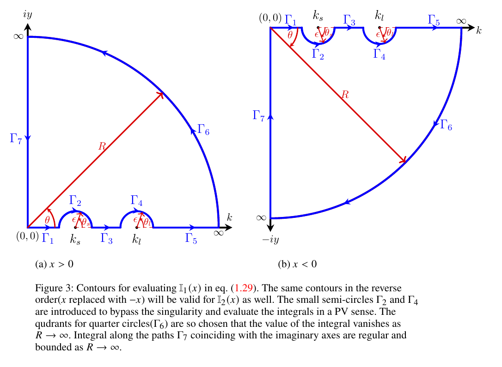

# Proof: Steady-state solution for finite capillarity ($\alpha > 0$)

## Evaluation of time-independent term $\eta_{s}(x)$

For $\alpha>0$, the time-independent term $\eta_s(x)$ is given by:

**(S.1)**
```math
\dfrac{\eta_{s}(x)}{F_0} = -\frac{1}{2 \pi} \left[\mathbb{I}_1(x) + \mathbb{I}_2(x)\right],
```
where,

**(S.2)**
```math
\mathbb{I}_1(x) = \int_{0}^{\infty}dk\;\dfrac{\exp\left(ikx\right)}{\alpha(k-k_l)(k-k_s)},
```

**(S.3)**
```math
\mathbb{I}_2(x) = \int_{0}^{\infty}dk\;\dfrac{\exp\left(-ikx\right)}{\alpha(k-k_l)(k-k_s)}.
```



---

The integrals $\mathbb{I}_1(x)$ and $\mathbb{I}_2(x)$ (obtained by ignoring time-dependent terms in eqns $3.8$ of manuscript) are singular at $k=k_l$ and $k=k_s$, lying along the line of integration as shown in Figure S1(a).
The integrals are interpreted in a PV sense
and evaluated using the contour integration method using the contour shown in Figure S1(a).

Consider the integral $\mathbb{I}_1^c(x)$ along the closed contour shown in Figure 3(a) for $x>0$,

**(S.4)**

```math
\mathbb{I}_1^c(x) = \frac{1}{\alpha}\oint dz \,  \frac{\exp\left(izx\right)}{(z - k_l)(z - k_s)}, \qquad x>0.
```

Integral $\mathbb{I}_1^c(x)$ will be zero as the closed contour does not enclose any singularity. Further, upon breaking this integral along the individual segments of the contour, one may write as,

**(S.5)**
```math
\begin{aligned}
	\mathbb{I}_1^c(x) = 0 &= \frac{1}{\alpha}	\int_{\Gamma_1} dz\, \frac{\exp(izx)}{(z - k_l)(z - k_s)}
	+\frac{1}{\alpha}\int_{\Gamma_2} dz\, \frac{\exp(izx)}{(z - k_l)(z - k_s)}
	+\frac{1}{\alpha}\int_{\Gamma_3} dz\, \frac{\exp(izx)}{(z - k_l)(z - k_s)}
	\\
	&+\frac{1}{\alpha}\int_{\Gamma_4} dz\, \frac{\exp(izx)}{(z - k_l)(z - k_s)}
	+\frac{1}{\alpha}\int_{\Gamma_5} dz\, \frac{\exp(izx)}{(z - k_l)(z - k_s)}
	\\
	&+\frac{1}{\alpha}\int_{\Gamma_6} dz\, \frac{\exp(izx)}{(z - k_l)(z - k_s)}
	+\frac{1}{\alpha}\int_{\Gamma_7} dz\, \frac{\exp(izx)}{(z - k_l)(z - k_s)}.
\end{aligned}
```

The integral on the large quarter circle $\Gamma_6$ tends to zero as $R \to \infty$ for $x>0$, as argued below,

**(S.6)**
```math
\lim_{R \rightarrow \infty} \left[\frac{1}{\alpha}\int_{\Gamma_6} dz\, \frac{\exp(izx)}{(z - k_l)(z - k_s)}\right]=\lim_{R \rightarrow \infty}\left[ \frac{1}{\alpha} \int_{0}^{\frac{\pi}{2}} d\theta \, iR \exp(i \theta)  \frac{\exp\left(ixR \cos(\theta)\right)\exp\left(-xR \sin(\theta)\right)}{(R \exp(i \theta) - k_l)(R \exp(i \theta) - k_s)} \right],
```

the value of the integrand above is governed by the factor $\exp(-xR\sin\theta)$ which tends to zero as $R \to \infty$ for $x>0$ by Jordan's lemma, since $\sin(\theta)$ is always positive in the first quadrant. In view of this, eqn. (S.5) reduces to,

**(S.7)**
```math
\begin{aligned}
	&\frac{1}{\alpha} \lim_{\substack{\epsilon \to 0 \\ R \to \infty}} \left[\int_{0}^{k_s-\epsilon}dk\, 
	\frac{\exp\left(ikx\right)}{(k-k_l)(k-k_s)}
	+
	\int_{k_s+\epsilon}^{k_l-\epsilon}
	dk\,\frac{\exp\left(ikx\right)}{(k-k_l)(k-k_s)}	
	+
	\int_{k_l+\epsilon}^{R}dk\,
	\frac{\exp\left(ikx\right)}{(k-k_l)(k-k_s)}\right] \\ 
	&+
	\frac{1}{\alpha}  \lim_{\epsilon \to 0}\left[\int_{\pi}^{0}
	d\theta_s \, \frac{\left\{\exp \left(i \left[k_s+\epsilon \exp \left(i\theta_s\right)\right]x\right)\right\}\, \left\{i\epsilon \exp \left(i\theta_s\right)\right\} }
	{\left\{k_s+\epsilon \exp \left(i\theta_s\right)-k_l\right\}\left\{k_s+\epsilon \exp \left(i\theta_s\right)-k_s\right\}}\right] \\
	&+
	\frac{1}{\alpha}  \lim_{\epsilon \to 0}\left[\int_{\pi}^{0}
	d\theta_l \, \frac{\left\{\exp \left(i \left[k_l+\epsilon \exp \left(i\theta_l\right)\right]x\right)\right\}\, \left\{i\epsilon \exp \left(i\theta_l\right)\right\} }
	{\left\{k_l+\epsilon \exp \left(i\theta_l\right)-k_l\right\}\left\{k_l + \epsilon \exp \left(i\theta_l\right)-k_s\right\}}\right] 
	\\
	&+ \frac{1}{\alpha}
	\int_{\infty}^{0} dy\,\exp \left(i\frac{\pi}{2}\right)
	\frac{ \exp \left(i \left[\exp \left(i\frac{\pi}{2}\right)y\right] x\right)}{\left\{\exp \left(i\frac{\pi}{2}\right)y-k_l\right\}\left\{\exp \left(i\frac{\pi}{2}\right)y-k_s\right\}}\, =0.
\end{aligned}
```

Upon completing the limiting process and identifying the first three terms with the PV of $\mathbb{I}_1(x)$ and evaluating the remaining terms, one obtains,

**(S.8)**
```math
\operatorname{PV}\! \left[\mathbb{I}_1(x)\right] = \frac{1}{\alpha (k_l-k_s)} \left[-i \pi \exp \left(ik_s x\right)+i \pi \exp \left(ik_l x\right)\right]
	+\frac{i}{\alpha} \int_{0}^{\infty} dy\,  \frac{\exp \left(-yx\right)}{(iy-k_l)(iy-k_s)}, \quad x>0.
```

Similarly for $x<0$ one performs similar steps of contour integration using the contour in Figure 3(b) and obtains,

**(S.9)**
```math
\operatorname{PV}\! \left[\mathbb{I}_1(x)\right] = \frac{1}{\alpha (k_l-k_s)} \left[i \pi \exp \left(ik_s x\right)-i \pi \exp \left(ik_l x\right)\right]
	-\frac{i}{\alpha} \int_{0}^{\infty} dy\,  \frac{\exp \left(yx\right)}{(iy+k_l)(iy+k_s)}, \quad x<0.
```

The integral $\mathbb{I}_2(x)$ in eqn. (S.3) is the same as $\mathbb{I}_1(x)$ with $x$ replaced with $-x$, accordingly one may write

**(S.10)**
```math
\operatorname{PV}\! \left[\mathbb{I}_2(x)\right]= \frac{1}{\alpha (k_l-k_s)} \left[i \pi \exp \left(-ik_s x\right)-i \pi \exp \left(-ik_l x\right)\right]
	-\frac{i}{\alpha} \int_{0}^{\infty} dy\,  \frac{\exp \left(-yx\right)}{(iy+k_l)(iy+k_s)},\quad x>0.
```

and

**(S.11)**
```math
\operatorname{PV}\! \left[\mathbb{I}_2(x)\right]  = \frac{1}{\alpha (k_l-k_s)} \left[-i \pi \exp \left(-ik_s x\right)+i \pi \exp \left(-ik_l x\right)\right]
	+\frac{i}{\alpha} \int_{0}^{\infty} dy\,  \frac{\exp \left(yx\right)}{(iy-k_l)(iy-k_s)},\quad x<0.
```

Upon plugging eqns. (S.8) and (S.10) (for $x>0$) and eqns. (S.9) and (S.11) (for $x<0$) into eqn. (S.1) and separating the real and imaginary parts (which becomes zero), one obtains symmetric expressions for $x>0$ and $x<0$. Since this is expected — the integral expression for $\eta_{s}(x)$ contains a symmetrical term namely $\cos(kx)$ — taking this symmetry into account one may write down the final expression as,

**(S.12)**
```math
\dfrac{\eta_{s}(x)}{F_0} = \dfrac{1}{\alpha (k_l-k_s)}\bigg\{-\sin(k_s|x|) + \sin(k_l|x|)\bigg\} + \left(\frac{k_l+k_s}{\pi \alpha}\right) \int_{0}^{\infty}dy \dfrac{y\exp\left(-|x|y\right)}{\left(y^2 + k_l^2\right)\left(y^2+k_s^2\right)}, \quad -\infty<x<\infty.
```

It may be noted while the first two terms shows a far-field steady wavy pattern both upstream and downstream, the third term is a localised contribution which decays to zero rapidly as $|x| \to \infty$ and possesses a finite value at $x=0$: $\left(\frac{k_l+k_s}{2 \pi \alpha (k_l-k_s)}\right) \log \left(\frac{k_l}{k_s}\right)$. It may be remarked that eqn. (S.12) is a symmetrical solution implying the existence of both the gravity and capillary waves, symmetrically both in the upstream and downstream directions. Since it contradicts the observation that in steady state, gravity wave exists only in the downstream direction and capillary wave exists in the upstream direction, one suspects that this asymmetry will be introduced from the time-dependent part of the solution. Accordingly we perform analysis of the long time asymptotics of $\eta_{tr}(x,t)$.

The local (exponential-decay) term in eqn. (S.12) can further be shown to be exactly equivalent to Lamb's classical local function $G(x)$; for the proof, see [Equivalence with Lamb's local function](lamb_gx_equivalence.md).
